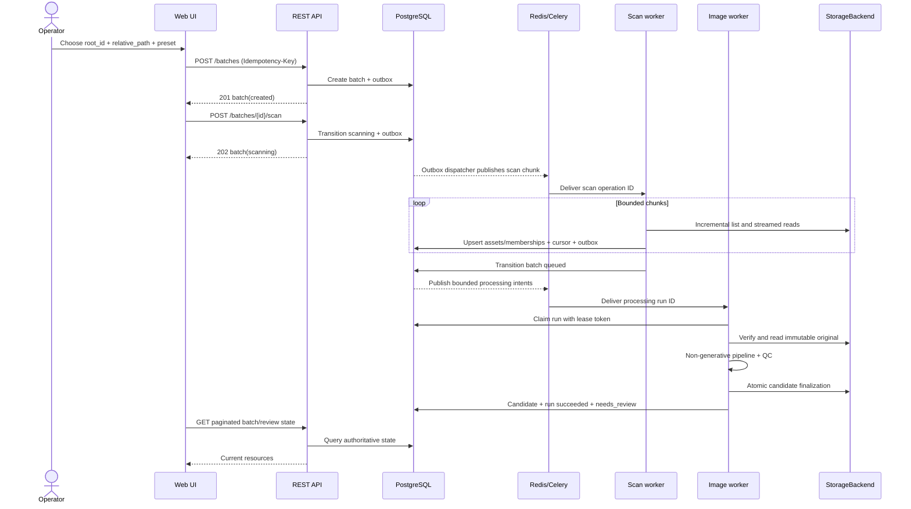

# Batch Processing Sequence

Derived from [system architecture](../architecture/system-architecture.md), [state machines](../architecture/state-machines.md), and [worker design](../architecture/worker-and-queue-design.md).

