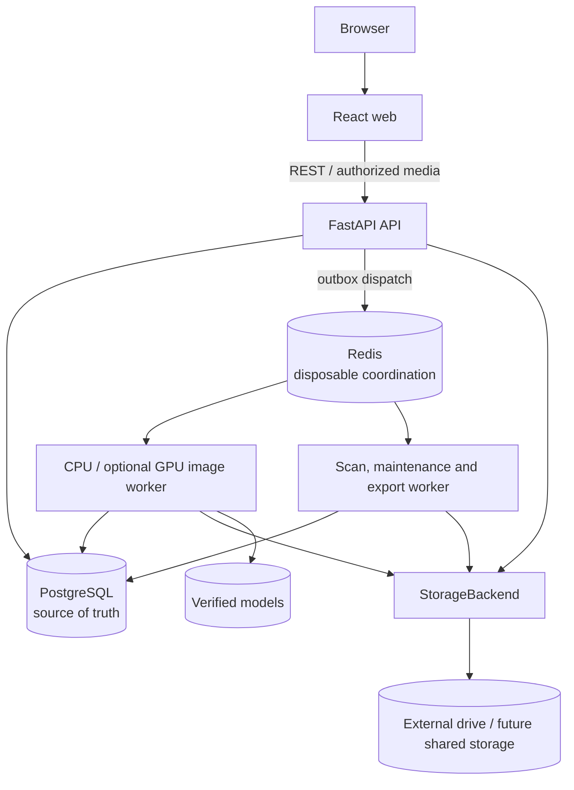

# Container Architecture

Derived from [system architecture](../architecture/system-architecture.md) and [deployment](../architecture/deployment.md).

```mermaid
flowchart TB
    Browser[Browser]
    Web[React web]
    API[FastAPI API]
    ImageWorker[CPU / optional GPU image worker]
    OpsWorker[Scan, maintenance and export worker]
    DB[(PostgreSQL\nsource of truth)]
    Redis[(Redis\ndisposable coordination)]
    Storage[StorageBackend]
    Drive[(External drive / future shared storage)]
    Models[(Verified models)]

    Browser --> Web
    Web -->|REST / authorized media| API
    API --> DB
    API -->|outbox dispatch| Redis
    Redis --> ImageWorker
    Redis --> OpsWorker
    ImageWorker --> DB
    OpsWorker --> DB
    API --> Storage
    ImageWorker --> Storage
    OpsWorker --> Storage
    Storage --> Drive
    ImageWorker --> Models
```
