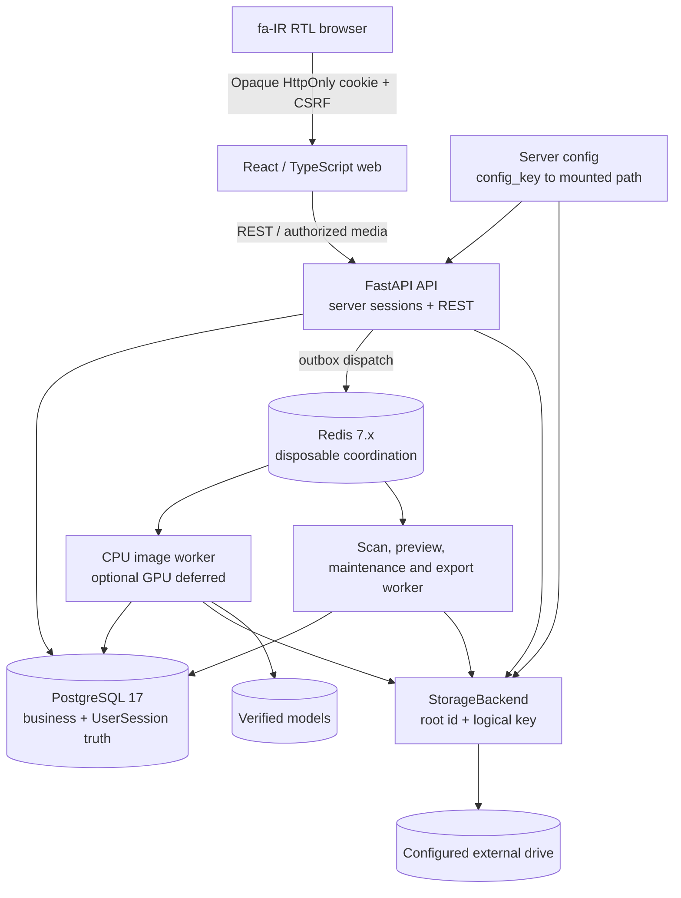

# Container Architecture

Derived from [system architecture](../architecture/system-architecture.md), [security](../architecture/security.md), and [deployment](../architecture/deployment.md).

```mermaid
flowchart TB
    Browser[fa-IR RTL browser]
    Web[React / TypeScript web]
    API[FastAPI API\nserver sessions + REST]
    ImageWorker[CPU image worker\noptional GPU deferred]
    OpsWorker[Scan, preview, maintenance and export worker]
    DB[(PostgreSQL 17\nbusiness + UserSession truth)]
    Redis[(Redis 7.x\ndisposable coordination)]
    RootConfig[Server config\nconfig_key to mounted path]
    Storage[StorageBackend\nroot id + logical key]
    Drive[(Configured external drive)]
    Models[(Verified models)]

    Browser -->|Opaque HttpOnly cookie + CSRF| Web
    Web -->|REST / authorized media| API
    API --> DB
    API -->|outbox dispatch| Redis
    Redis --> ImageWorker
    Redis --> OpsWorker
    ImageWorker --> DB
    OpsWorker --> DB
    RootConfig --> API
    RootConfig --> Storage
    API --> Storage
    ImageWorker --> Storage
    OpsWorker --> Storage
    Storage --> Drive
    ImageWorker --> Models
```
