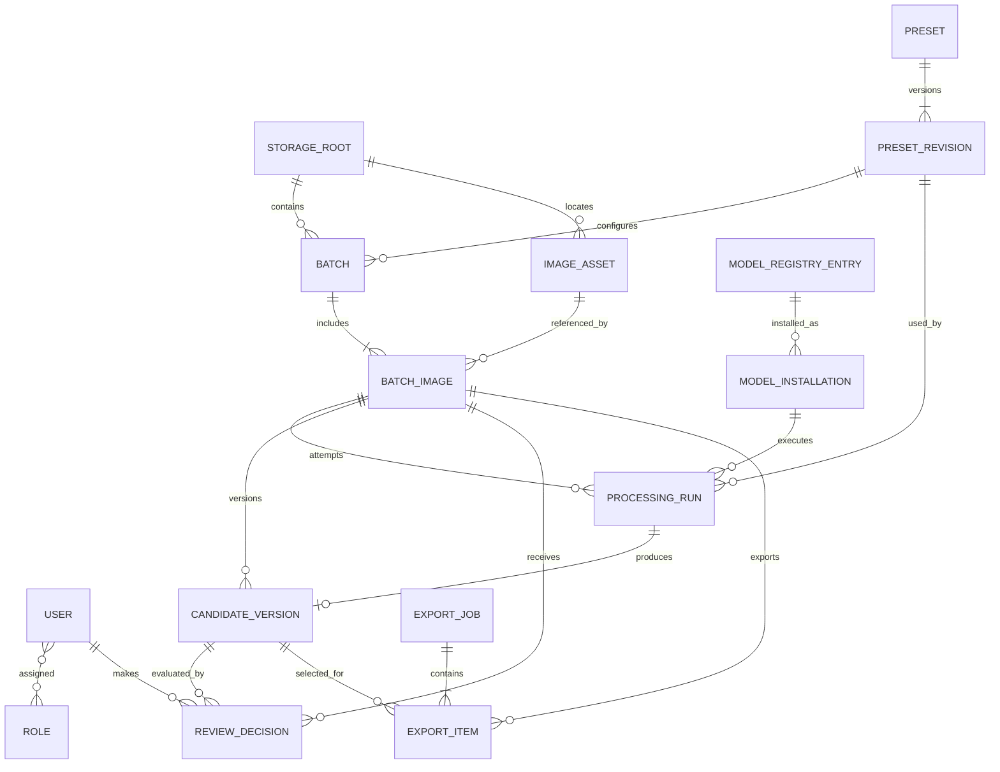

# Entity Relationship Diagram

Derived from [domain model](../architecture/domain-model.md) and [database design](../architecture/database-design.md).

```mermaid
erDiagram
    USER }o--o{ ROLE : assigned
    USER ||--o{ REVIEW_DECISION : makes
    STORAGE_ROOT ||--o{ BATCH : contains
    STORAGE_ROOT ||--o{ IMAGE_ASSET : locates
    PRESET ||--|{ PRESET_REVISION : versions
    PRESET_REVISION ||--o{ BATCH : configures
    BATCH ||--|{ BATCH_IMAGE : includes
    IMAGE_ASSET ||--o{ BATCH_IMAGE : referenced_by
    BATCH_IMAGE ||--o{ PROCESSING_RUN : attempts
    PROCESSING_RUN ||--o| CANDIDATE_VERSION : produces
    PRESET_REVISION ||--o{ PROCESSING_RUN : used_by
    MODEL_REGISTRY_ENTRY ||--o{ MODEL_INSTALLATION : installed_as
    MODEL_INSTALLATION ||--o{ PROCESSING_RUN : executes
    BATCH_IMAGE ||--o{ CANDIDATE_VERSION : versions
    BATCH_IMAGE ||--o{ REVIEW_DECISION : receives
    CANDIDATE_VERSION ||--o{ REVIEW_DECISION : evaluated_by
    EXPORT_JOB ||--|{ EXPORT_ITEM : contains
    BATCH_IMAGE ||--o{ EXPORT_ITEM : exports
    CANDIDATE_VERSION ||--o{ EXPORT_ITEM : selected_for
```
