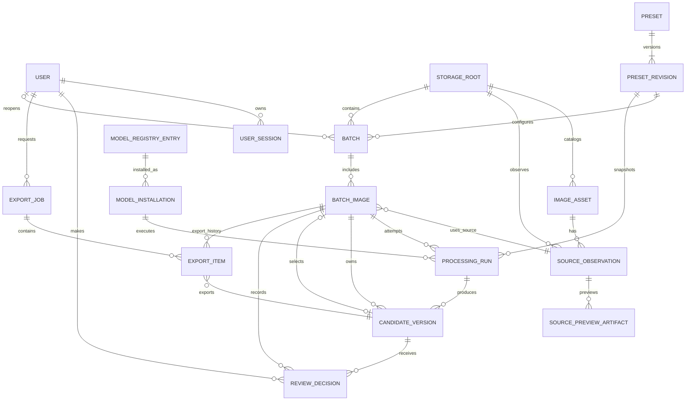

# Entity Relationship Diagram

Derived from [domain model](../architecture/domain-model.md) and [database design](../architecture/database-design.md). `Role` is a fixed User value, not a table.

The ownership and selected-candidate relationships are intentionally separate. `batch_images.selected_candidate_id` must reference a CandidateVersion owned by that same BatchImage. ReviewDecision must reference a CandidateVersion belonging to its BatchImage. ExportItem must reference the exact human-approved selected CandidateVersion for its BatchImage. Mermaid cannot fully express those conditional same-parent rules, so PostgreSQL enforces them with the composite keys/FKs defined in [database design](../architecture/database-design.md), plus transactional approval validation.
