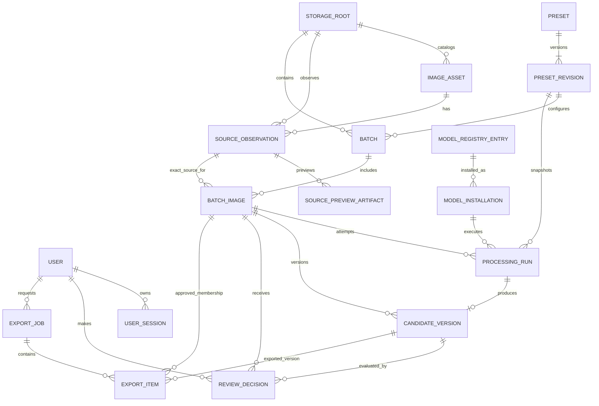

# Entity Relationship Diagram

Derived from [domain model](../architecture/domain-model.md) and [database design](../architecture/database-design.md). `Role` is a fixed User value, not a table.

```mermaid
erDiagram
    USER ||--o{ USER_SESSION : owns
    USER ||--o{ REVIEW_DECISION : makes
    USER ||--o{ EXPORT_JOB : requests
    STORAGE_ROOT ||--o{ IMAGE_ASSET : catalogs
    STORAGE_ROOT ||--o{ SOURCE_OBSERVATION : observes
    STORAGE_ROOT ||--o{ BATCH : contains
    IMAGE_ASSET ||--o{ SOURCE_OBSERVATION : has
    SOURCE_OBSERVATION ||--o{ SOURCE_PREVIEW_ARTIFACT : previews
    PRESET ||--|{ PRESET_REVISION : versions
    PRESET_REVISION ||--o{ BATCH : configures
    BATCH ||--o{ BATCH_IMAGE : includes
    SOURCE_OBSERVATION ||--o{ BATCH_IMAGE : exact_source_for
    BATCH_IMAGE ||--o{ PROCESSING_RUN : attempts
    PROCESSING_RUN ||--o| CANDIDATE_VERSION : produces
    PRESET_REVISION ||--o{ PROCESSING_RUN : snapshots
    MODEL_REGISTRY_ENTRY ||--o{ MODEL_INSTALLATION : installed_as
    MODEL_INSTALLATION ||--o{ PROCESSING_RUN : executes
    BATCH_IMAGE ||--o{ CANDIDATE_VERSION : versions
    BATCH_IMAGE ||--o{ REVIEW_DECISION : receives
    CANDIDATE_VERSION ||--o{ REVIEW_DECISION : evaluated_by
    EXPORT_JOB ||--o{ EXPORT_ITEM : contains
    BATCH_IMAGE ||--o{ EXPORT_ITEM : approved_membership
    CANDIDATE_VERSION ||--o{ EXPORT_ITEM : exported_version
```
