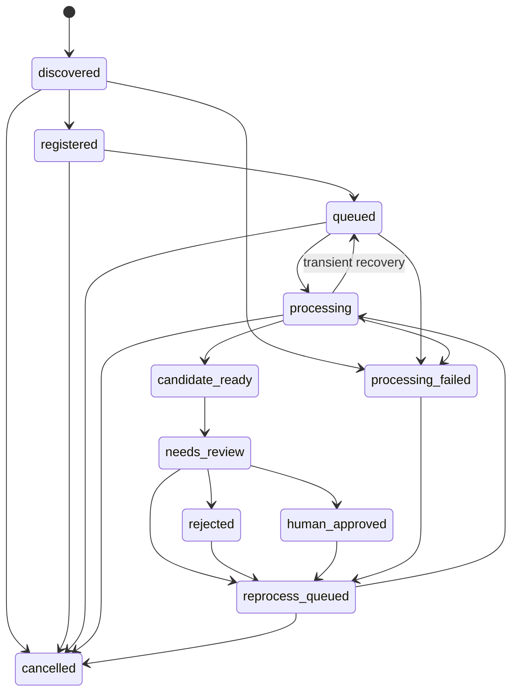
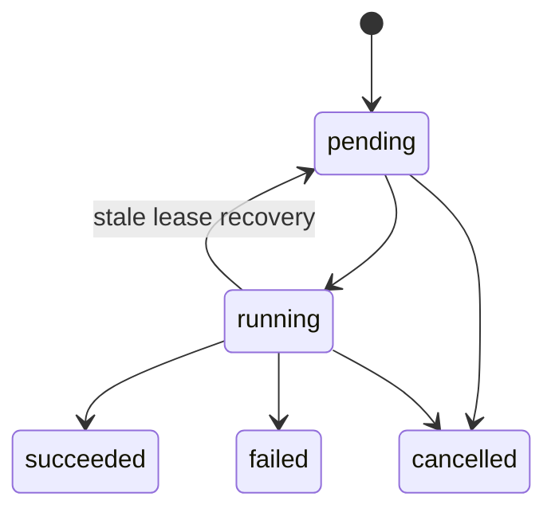
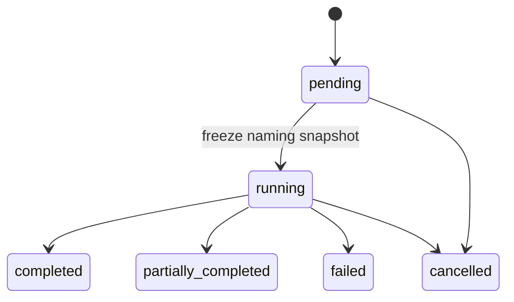
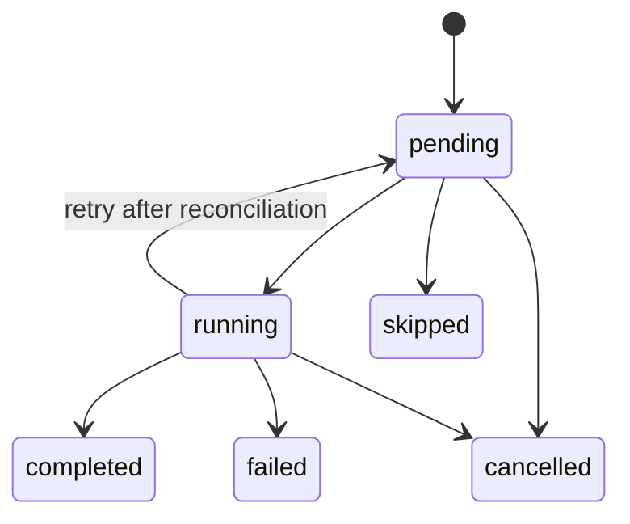

# State Machines

Derived from the authoritative [state-machine specification](../architecture/state-machines.md). Batch/BatchImage processing-review lifecycles are independent from export.

## Batch

```mermaid
stateDiagram-v2
    [*] --> created
    created --> scanning
    created --> cancelled
    scanning --> scan_paused
    scan_paused --> scanning
    scan_paused --> cancelled
    scanning --> queued
    scanning --> review_completed: zero members
    scanning --> failed
    scanning --> cancelled
    queued --> processing
    queued --> cancelled
    processing --> awaiting_review
    processing --> review_completed: all resolved; no failures/cancelled
    processing --> partially_completed: resolved with failures/cancelled
    processing --> failed: batch-level failure
    processing --> cancelled
    awaiting_review --> processing: reprocess
    awaiting_review --> review_completed
    awaiting_review --> partially_completed
    awaiting_review --> cancelled
```

## BatchImage

## ProcessingRun

## ExportJob

## ExportItem

