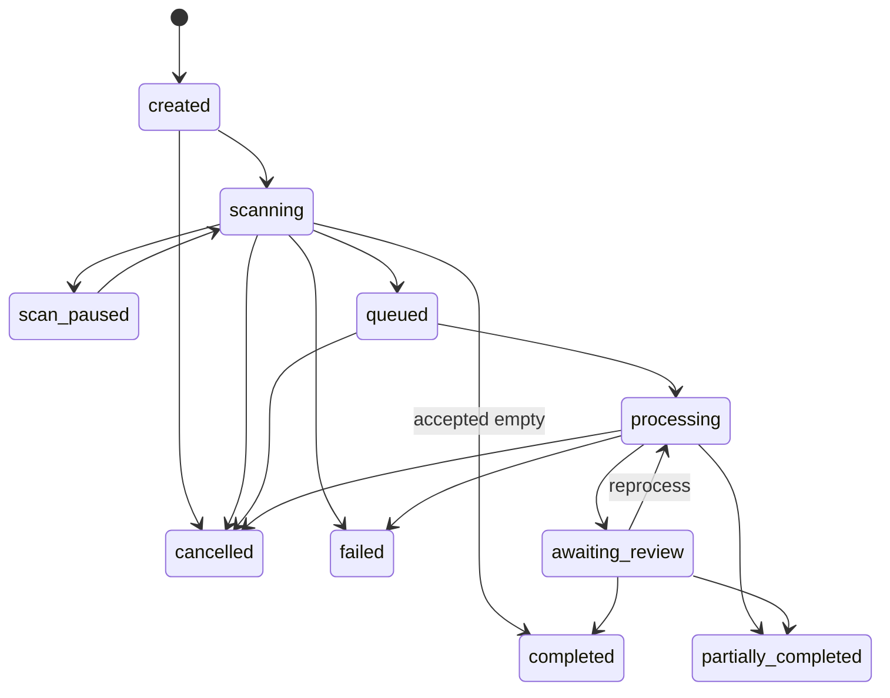
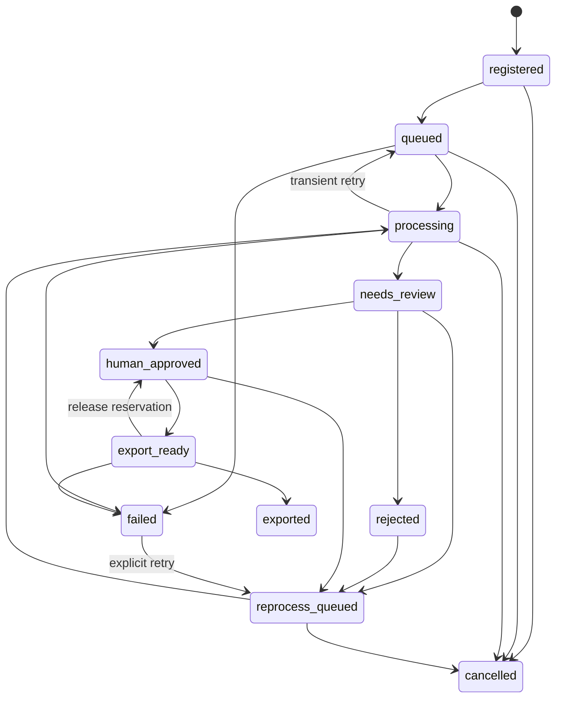
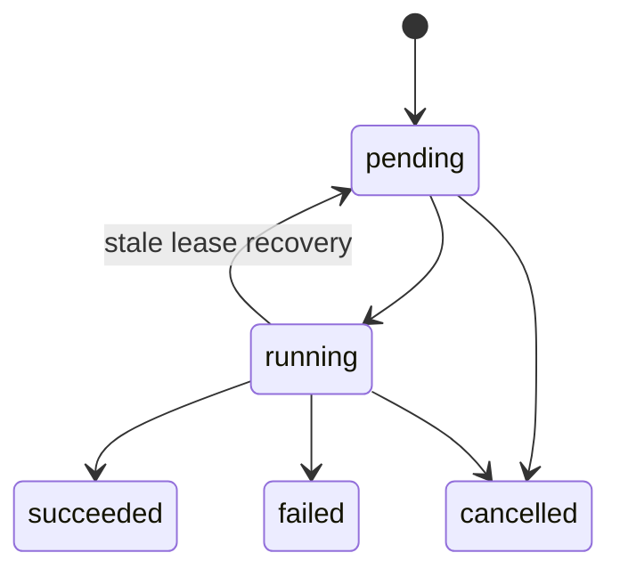
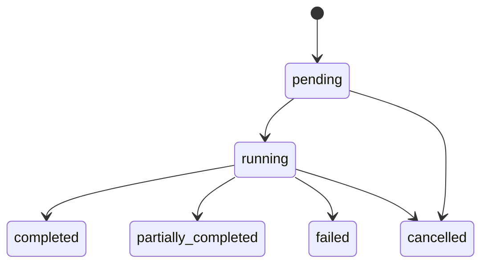

# State Machines

Derived from the authoritative [state-machine specification](../architecture/state-machines.md). Terminal and exceptional details remain in that document.

## Batch

## Image Membership

## Processing Run

## Export Job

