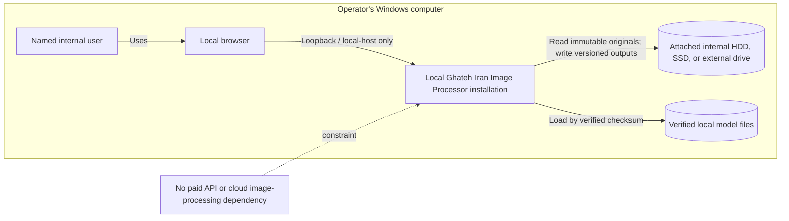

# System Context

Derived from [system architecture](../architecture/system-architecture.md).

```mermaid
flowchart LR
    subgraph Host[Operator's Windows computer]
        User[Named internal user]
        Browser[Local browser]
        System[Local Ghateh Iran Image Processor installation]
        Storage[(Attached internal HDD, SSD, or external drive)]
        Models[(Verified local model files)]

        User -->|Uses| Browser
        Browser -->|Loopback / local-host only| System
        System -->|Read immutable originals; write versioned outputs| Storage
        System -->|Load by verified checksum| Models
    end

    note[No paid API or cloud image-processing dependency]
    note -. constraint .-> System
```
