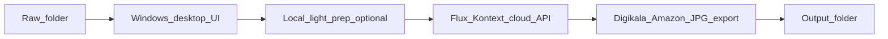

# Flux Kontext Bulk Editing — Research Report + Learning PBIs

## Verdict (read this first)

**Local FLUX.1 Kontext on a 4GB GPU (e.g. GTX 1650 Super) is not viable for bulk ecommerce (5,000 images).**

| Path                                             | Viable for V1 bulk?   | Why                                                                                                                                     |
| ------------------------------------------------ | --------------------- | --------------------------------------------------------------------------------------------------------------------------------------- |
| Pure local Kontext GGUF on 4GB                   | No                    | Model alone ~4GB at Q2; plus T5/VAE/activations forces heavy RAM offload → often **minutes per image**, quality loss at Q2/Q3, OOM risk |
| Local Kontext on 8–12GB+                         | Learning/spike only   | Still slow for 5k; **Dev weights are non-commercial** (bad for a shop product)                                                          |
| **Hybrid: Windows app + cloud Flux Kontext API** | **Yes — recommended** | ~$0.025–$0.04/image, seconds per edit, commercial Pro available, batchable                                                              |

**Production recommendation:** Build the simple Windows app (folder in → Start/Stop → logs → %) that calls **fal.ai FLUX.1 Kontext [pro]** (or RunPod Kontext Dev endpoint for cheaper tests). Use a **fixed ecommerce prompt template**. Match quality to your golden AI samples via a short spike, then scale.

**Cost estimate (API only, Aug 2026 published rates):**

| Volume | fal Kontext Pro (~$0.04) | RunPod Kontext Dev (~$0.025) |
| ------ | ------------------------ | ---------------------------- |
| 5,000  | ~**$200**                | ~**$125**                    |
| 10,000 | ~**$400**                | ~**$250**                    |

Plus your sell price to shops (e.g. $0.15–0.35/image) for margin. Treat as estimates; verify live dashboard pricing before pilots.

---

## Cheaper paid options vs “same quality” (updated)

**Is there something cheaper than fal Kontext Pro (~$0.04) with the same look as your goldens?**

**Maybe slightly cheaper — not dramatically, and not guaranteed same quality until A/B on your 4 pairs.**

| API / path | Approx $/image | 5,000 cost | Same-quality chance vs goldens | Commercial for selling to shops? |
| --- | --- | --- | --- | --- |
| **fal FLUX Kontext Pro** | **~$0.04** | **~$200** | High (generative remake) | Yes |
| Replicate / others Kontext Pro | ~$0.04 | ~$200 | Same family | Yes |
| RunPod / Replicate **Kontext Dev** | ~$0.025 | ~$125 | Often close | **Risk** — Dev usually non-commercial |
| Qwen Image Edit / SeedEdit (Replicate) | ~$0.03 | ~$150 | Unknown — must A/B | Check each provider ToS |
| GPT Image (OpenAI) medium | ~$0.04 | ~$200 | Often strong | Yes |
| GPT Image low / mini | ~$0.005–0.02 | ~$25–100 | Usually **weaker** | Yes |
| **Photoroom API Basic** (remove BG) | **~$0.02** (+$20/mo floor) | **~$100+** | Cutout path — may miss “studio remake” | Yes (paid API) |
| Photoroom API Plus (AI shadow/relight) | ~$0.10 | ~$500 | High ecommerce fit | Yes — **more expensive** than Kontext |
| Photoroom Startup credits | Free trial pool | $0 briefly | Demo only | Apply if eligible |

**Practical takeaway**

- **Cheaper and still generative:** try **~$0.025–0.03** (Kontext Dev hosts, Qwen/SeedEdit) on the 4 goldens — save ~25–40% vs Pro **only if** quality + license pass.
- **Cheapest serious ecommerce API:** Photoroom Basic **~$0.02** — great if cutout+white+API shadow is enough; if your goldens need full remake, Plus at **$0.10** is *worse* value than Kontext Pro.
- **No credible ~$0.005 “same as goldens” commercial API** for this remake look at Digikala resolution.

**Recommended price ladder for the spike (not locked to one vendor):**

1. Photoroom Basic (~$0.02) on 4 pairs → score vs goldens  
2. If fail: fal Kontext Pro (~$0.04) or Qwen Edit (~$0.03) A/B  
3. Skip Photoroom Plus as default (~$0.10) unless it uniquely wins quality  
4. Avoid Dev weights as the **sold** engine until license cleared  

---

## Free path — honest answer (any model, not only Flux)

**Question:** Is there *any* option (Flux or otherwise) with the **same quality** as your golden edits, usable for free?

**Short answer:** There is **no free unlimited commercial path that reliably matches generative remakes** (ChatGPT / Kontext / Photoroom AI studio look) at 5,000 images. Free SaaS tiers are capped, watermarked, low-res, or **non-commercial**.

### What “same quality” means for *your* goldens

Your edits are not only cutout. They typically:

1. Kill clutter → pure `#FFFFFF`
2. Soft studio contact shadow (sometimes almost none, e.g. Samsung)
3. Clean dust / even lighting / punchier color
4. Keep product identity and logos

Item (1) is classical **segmentation**. Items (2)–(3) often need **generative edit** or careful compositing. Generative = usually paid at bulk + commercial rights.

### Best free option that can get *close* (recommended to test first)

| Approach | Cost | Commercial? | Vs your goldens |
| --- | --- | --- | --- |
| **Local BiRefNet** (MIT) + white composite + synthetic soft shadow | $0 API (GPU/CPU time only) | Yes (MIT) | Often strong on hard plastic/hose; may lose vs AI remake on white bags, glare cleanup, “new studio photo” feel |
| Local rembg / ISNet | $0 | Usually yes | Weaker edges than BiRefNet |
| Photoroom / remove.bg free | $0 briefly | Photoroom free = **personal only**; remove.bg free = tiny preview | Not for 5k shop product |
| Local Flux Kontext Dev GGUF | $0 API | Often **non-commercial Dev** | Slow on 4GB; not same as Pro; license risk if you sell edits |
| Cloud Kontext / gpt-image / Photoroom paid | Cents–$0.04+/img | Yes if you buy commercial tier | Closest match to goldens |

**Best free path to try:** Windows batch → **BiRefNet cutout** → `#FFFFFF` → optional soft drop shadow → center/export square. Compare side-by-side to your 4 goldens. If gap is small enough for Digikala, you can ship V1 at $0 API. If gap is “looks like a new photo” vs “cutout on white”, pay for generative (Kontext/Photoroom/etc.).

**Best paid path if goldens must match:** Cloud generative edit (Kontext Pro or Photoroom API) — model brand secondary; **quality + commercial license + $/image** decide.

### Decision gate (before building the Windows app)

1. Run the 4 golden raws through free BiRefNet pipeline (spike).
2. Score vs edited goldens with the acceptance checklist.
3. If pass → free local engine. If fail → paid generative API.

---

## Golden set — PBI-001/002 LOCKED

Four raw↔edited pairs received. Target look: Digikala/Amazon main-image studio remake (not a flat rembg cutout).

### Pairs

| ID | Product | Raw failure modes | Edited target |
| --- | --- | --- | --- |
| hose | Braided black hose, red/white stripe | Gray table, dust, natural soft shadow | Pure white BG; soft contact shadow under coil; deep blacks; vivid red; braid texture sharp |
| bosch_nozzle | Bosch floor tool (diagonal) | Chair legs / room clutter, glare, uneven light | Pure white BG; soft drop shadow; clean edges on neck; BOSCH logo crisp; balanced speculars |
| parskazar_bags | Parskazar bags + box | Warehouse clutter; white-on-white bags/table | Pure white BG; soft shadow under bags; box text legible (Parskazar 505, NEW, Micro dust bag); blue plate saturated |
| samsung_brush | Samsung Smart Brush | Person's legs, chair, tiled floor, white board | Pure white BG; **minimal/no floor shadow** (cleaner float than hose/Bosch); logos/icons crisp; centered |

Asset paths (Cursor workspaceStorage copies under project `assets/`):

- Raw: `photo_2026-07-21_22-38-45…`, `22-39-03…`, `2026-08-02_18-31-43…`, `22-39-21…`
- Edited: `photo_2026-08-11_17-12-52…` (bags), `17-13-01…` (hose), `17-13-10…` (Bosch), `17-13-17…` (Samsung)

### Acceptance checklist (any AI output vs golden)

1. Background is seamless **#FFFFFF** — no table, floor, people, chairs, shelves.
2. Product identity preserved (shape, logos, colors, braid/plastic/fabric texture) — no inventing new parts.
3. Soft studio lighting; blacks deep but not crushed; no heavy glare.
4. Shadow policy: soft contact/drop shadow OK (hose, Bosch, bags); Samsung may be near-shadowless — match sample.
5. Framing: product large/centered (~70–85% of frame); square export target later (~2000² JPG).
6. Text on packaging/logos remains readable (Parskazar, BOSCH, SAMSUNG, Smart Brush).
7. No watermarks, no extra props, no background gradients.

### Prompt draft direction (for later cloud spike)

Instruction-style edit: *replace background with pure white studio; keep exact product; soft natural contact shadow; clean dust; even ecommerce lighting; do not change branding or geometry.*

---

## Part A — Technical research findings

### A1. What “Flux Context” actually is

Official name: **FLUX.1 Kontext** (Black Forest Labs) — instruction-based **image editing** (img+text → edited img), strong at preserving subject/identity while changing background/lighting/scene.

Variants:

- **Kontext [dev]** — open weights, community GGUF; **non-commercial license** on Dev lineage
- **Kontext [pro] / [max]** — API-only, commercial-friendly hosting (fal, BFL partners)

For a **startup selling to Digikala/Amazon shops**, do **not** ship local Dev weights as the product engine without legal review. Prefer **Pro API**.

### A2. High-efficiency local inference (4GB reality)

**Quantization (UNET GGUF sizes, Unsloth/QuantStack):**

| Quant    | Approx size | 4GB fit?                                        |
| -------- | ----------- | ----------------------------------------------- |
| Q2_K     | ~4.02 GB    | Barely UNET-only; activations still blow budget |
| Q3_K_S   | ~5.23 GB    | Needs offload on 4GB                            |
| Q4_K_S   | ~6.8 GB     | Needs 6–8GB+ or heavy offload                   |
| Q5+ / Q8 | 8–12.7 GB   | Not for 4GB                                     |

**Required stack if experimenting locally:**

- [city96/ComfyUI-GGUF](https://github.com/city96/ComfyUI-GGUF)
- Weights: [QuantStack/FLUX.1-Kontext-dev-GGUF](https://huggingface.co/QuantStack/FLUX.1-Kontext-dev-GGUF) or [unsloth/FLUX.1-Kontext-dev-GGUF](https://huggingface.co/unsloth/FLUX.1-Kontext-dev-GGUF)
- Community 4GB workflow notes: [The-frizzy1/Flux-Kontext-GGUF-4GB](https://huggingface.co/The-frizzy1/Flux-Kontext-GGUF-4GB)
- Launch: ComfyUI `--lowvram` (or `--novram` as last resort)
- Must also quantize/use FP8 **T5** — FP16 T5 alone can be ~9GB
- Tiled VAE; keep ~1024² or lower while testing; batch size 1

**Speed reality (community 2026 figures, approximate):**

- 8GB + Q4 + `--lowvram`: often **~90–150s**/1024² (20 steps) for Flux-class
- 6GB class / heavy offload: **many minutes**
- 4GB / `--novram`: **proof-of-concept only** (often 5–10+ min/image)

**Math for 5,000 images at 5 min/image local:** ~416 hours. Unusable for a shop product.

**Fastest “local while high quality” on 4GB:** There is no trustworthy answer that equals cloud Kontext Pro quality at shop speed. Local 4GB = learning lab, not factory.

### A3. Cloud / serverless options (production)

| Provider                                                                                   | Model       | Published price  | Notes                                  |
| ------------------------------------------------------------------------------------------ | ----------- | ---------------- | -------------------------------------- |
| [fal.ai flux-pro/kontext](https://fal.ai/models/fal-ai/flux-pro/kontext)                   | Kontext Pro | **$0.04/image**  | Strong default for commercial edit API |
| [RunPod flux-kontext-dev](https://docs.runpod.io/public-endpoints/models/flux-kontext-dev) | Kontext Dev | **$0.025/image** | Cheaper; check license/ToS for resale  |
| Replicate / Modal / HF Endpoints                                                           | varies      | verify live      | Same pattern: HTTP edit API            |

**Hybrid that fits your 4GB PC:**

- Local (4GB OK): EXIF normalize, resize-for-API, optional rembg **only if spike proves it helps**
- Cloud: fixed Kontext prompt for white ecommerce main image
- Local: center/pad/export 2000×2000 JPG if API output needs standardization

### A4. Bulk / headless automation

- ComfyUI: submit workflow JSON via HTTP/WebSocket queue API (headless server mode) — useful if you later rent a **12–24GB** GPU box
- For V1 shop app: **skip local ComfyUI**; call fal/RunPod REST directly from Python
- Batch pattern: worker queue, concurrency 2–4, retries on 429/5xx, cache by file hash+prompt version, Skip existing outputs

### A5. Alternatives if Kontext local is impossible (4GB)

For **local-only** learning on 4GB (not ChatGPT/Kontext parity):

- rembg / BiRefNet / RMBG-class cutout + white plate + soft shadow (fast, free, weaker remake)
- SD 1.5 + inpaint/ControlNet (fits 4GB; quality below Flux)
- SDXL Lightning/Turbo needs more VRAM for comfortable editing stacks

For **quality matching your samples**, alternatives are other **cloud edit APIs** (OpenAI gpt-image-2, Photoroom Edit, fal Nano Banana / Flux.2 Edit) — compare in a short paid spike of 10 golden pairs, not by building all into V1.

---

## Part B — Optimal architecture for your Windows app (locked)

**V1 production path:**

1. UI: Input folder, Output folder, Start, Stop, logs, progress %
2. Engine: **fal.ai FLUX.1 Kontext [pro]** with one frozen ecommerce prompt (Digikala/Amazon white main)
3. Export: square JPG ~2000×2000, pure white intent in prompt + light local standardize if needed
4. Config: API key in `.env` only
5. Optional later: “Local GGUF lab mode” behind a Research toggle — never default for 5k

**Why not pure local first:** Your constraint (4GB + 5k + shop-grade + match AI samples) conflicts with Flux Dev physics and license.

---

## Part C — Learning-oriented Product Backlog (no code yet)

Process rule for every **Research** PBI: you investigate → write a short report → I feedback → then Spike/Implement.

### Epic 0 — Golden samples and success

**PBI-001** Catalog raw vs AI-edited sample pairs (same stem naming)  
**PBI-002** Acceptance checklist (identity, white BG, edges, lighting, framing, Digikala/Amazon rules)

### Epic 1 — Understand Flux Kontext

**PBI-003** Read BFL Kontext docs: Dev vs Pro vs Max; what the model preserves vs changes  
**PBI-004** License research: can Dev GGUF be used in a commercial shop product? (expect: no → Pro API)  
**PBI-005** Write the fixed V1 prompt that should reproduce your sample style (white studio ecommerce main)

### Epic 2 — Local 4GB spike (learn limits, don’t bet the company)

**PBI-006** Install ComfyUI + ComfyUI-GGUF; download Q2/Q3 Kontext GGUF; run **one** image  
**PBI-007** Measure: VRAM peak, seconds/image, quality vs golden sample, OOM rate  
**PBI-008** Decision record: local 4GB for production? (Expected answer: No)

### Epic 3 — Cloud Kontext spike (quality + cost)

**PBI-009** Create fal (and/or RunPod) account; run same golden pairs via API  
**PBI-010** Side-by-side score vs samples (PBI-002); freeze prompt_version  
**PBI-011** Cost sheet: price × 5,000 / 10,000; max concurrency; rate limits

### Epic 4 — Hybrid pipeline design

**PBI-012** Decide local prep steps (resize? rembg? none?) with evidence from spike  
**PBI-013** Spec export profile Digikala JPG + Amazon 2000²  
**PBI-014** Spec Start/Stop/resume/cache/logging semantics

### Epic 5 — Windows app (implement only after Epic 3 locked)

**PBI-015** UI stack research (Python CustomTkinter vs alternatives) — report + pick one  
**PBI-016** Implement thin client: folders + Start/Stop + progress + logs calling frozen API template  
**PBI-017** Pilot 50–100 real catalog images; ≥90% accept rate target

### Epic 6 — Startup readiness

**PBI-018** Pricing model for sellers (your sell price vs API cost)  
**PBI-019** ToS/license checklist for reselling API-edited images to shops

---

## Part D — What you do next (learning order)

1. **PBI-001 + PBI-002** — drop sample pairs when ready; write checklist
2. **PBI-003 + PBI-004** — Kontext variants + license report to me
3. **PBI-006 + PBI-007** — optional 1-image local GGUF experiment (to feel the 4GB limit yourself)
4. **PBI-009 + PBI-010** — cloud Kontext spike on golden pairs (this decides quality)
5. Only then implement the Windows app (**PBI-015+**)

No application code until you approve the cloud spike results and frozen prompt.

---

## Key links (bookmark)

- city96 ComfyUI-GGUF: https://github.com/city96/ComfyUI-GGUF
- Kontext Dev GGUF: https://huggingface.co/QuantStack/FLUX.1-Kontext-dev-GGUF
- Unsloth GGUF: https://huggingface.co/unsloth/FLUX.1-Kontext-dev-GGUF
- 4GB community workflow: https://huggingface.co/The-frizzy1/Flux-Kontext-GGUF-4GB
- fal Kontext Pro: https://fal.ai/models/fal-ai/flux-pro/kontext
- RunPod Kontext Dev: https://docs.runpod.io/public-endpoints/models/flux-kontext-dev
- ComfyUI Kontext guide: https://comfyui-wiki.com/en/tutorial/advanced/image/flux/flux-1-kontext
